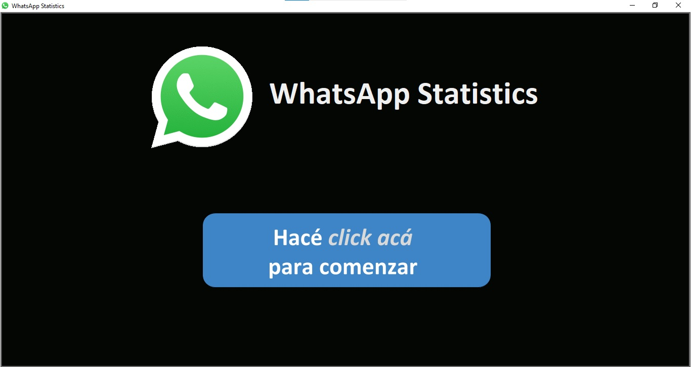
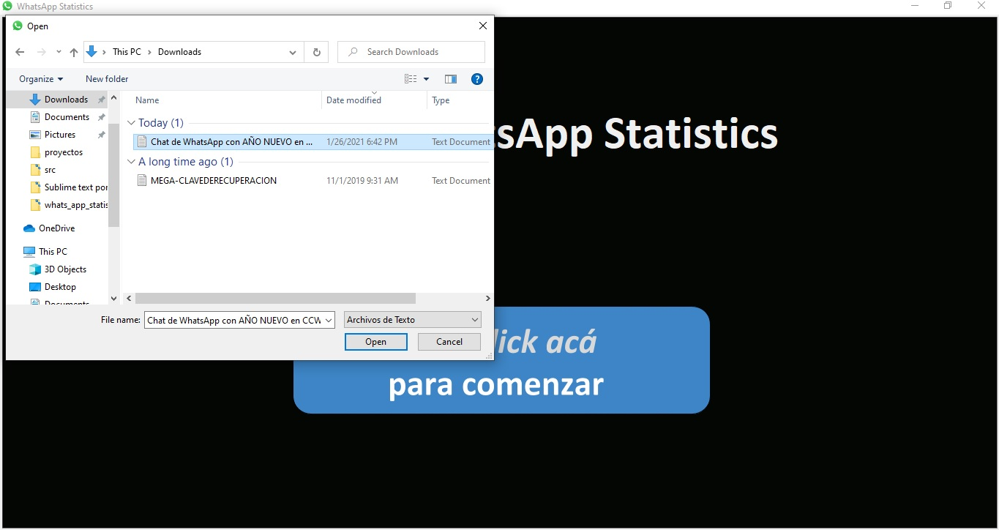
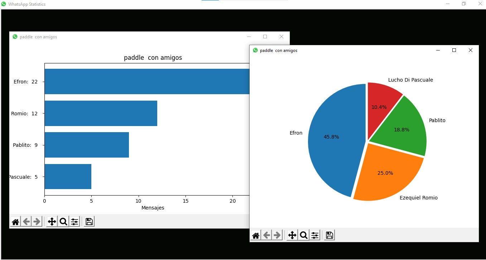

# whats_app_statistics   

_This app reads a chat file from a whatsapp group and shows the statistics of the user's messages_


## Example:

### Click on the button:



### Choose a file:



### Results are displayed on screen:




### Installation 🔧
 - Create a virtual enviroment
 - ```pip install -r requirements.txt```
 - Run the app (main.py)

_Must have a WhatsApp chat file to try it_

 - Export the chat from any group of WhatsApp Messenger **mobile** app
 - download the file to your pc

Only supports **.txt** format
